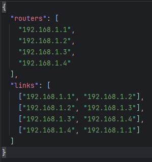
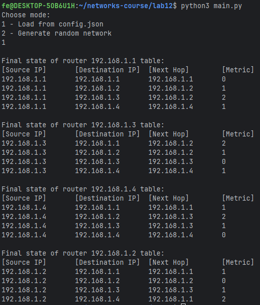
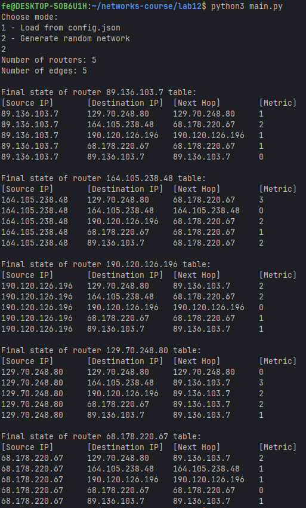

# Практика 12. Сетевой уровень

## 1. RIP (9 баллов)

### Задание А (6 баллов)
Реализуйте эмулятор работы протокола RIP в виде консольного приложения.
Ваша автономная сеть (АС) из маршрутизаторов может быть сконфигурирована на основе файла
(например, `.json`) либо генерироваться случайным образом каждый раз при запуске.

Каждый маршрутизатор должен иметь свой уникальный IP адрес. Это приложение не
предполагает передачу данных по сети, поэтому IP адреса, как и связи между маршрутизаторами,
могут быть произвольными.

Программа должна корректно работать с произвольной АС.

В конце работы программы для каждого маршрутизатора должна быть выведена таблица
маршрутизации. Пример таблицы:
```
Final state of router 198.71.243.61 table:
[Source IP]      [Destination IP]    [Next Hop]       [Metric]  
198.71.243.61    122.136.243.149     42.162.54.248           4  
198.71.243.61    157.105.66.180      42.162.54.248           2  
198.71.243.61    229.28.61.15        42.162.54.248           3  
198.71.243.61    42.162.54.248       42.162.54.248           1  
```

Приведите скрин или лог работы программы.

#### Демонстрация работы

`config.json`:







### Задание Б (1 балл)
Выведите на консоль промежуточные этапы работы протокола: по каждому маршрутизатору
должна быть выведена его текущая таблица маршрутизации.

```
Simulation step 3 of router 42.162.54.248
[Source IP]      [Destination IP]    [Next Hop]       [Metric]  
42.162.54.248    122.136.243.149     157.105.66.180          3  
42.162.54.248    157.105.66.180      157.105.66.180          1  
42.162.54.248    229.28.61.15        157.105.66.180          2  
42.162.54.248    198.71.243.61       198.71.243.61           1  
```

#### Демонстрация работы

##### Пример работы на графе из `config.json`

<details>

```text
fe@DESKTOP-5OB6U1H:~/networks-course/lab12$ python3 main.py
Choose mode:
1 - Load from config.json
2 - Generate random network
1

Simulation step 0 of router 192.168.1.1
[Source IP]       [Destination IP]  [Next Hop]        [Metric]  
192.168.1.1       192.168.1.1       192.168.1.1       0         
192.168.1.1       192.168.1.2       192.168.1.2       1         
192.168.1.1       192.168.1.4       192.168.1.4       1         

Simulation step 0 of router 192.168.1.2
[Source IP]       [Destination IP]  [Next Hop]        [Metric]  
192.168.1.2       192.168.1.1       192.168.1.1       1         
192.168.1.2       192.168.1.2       192.168.1.2       0         
192.168.1.2       192.168.1.3       192.168.1.3       1         

Simulation step 0 of router 192.168.1.3
[Source IP]       [Destination IP]  [Next Hop]        [Metric]  
192.168.1.3       192.168.1.2       192.168.1.2       1         
192.168.1.3       192.168.1.3       192.168.1.3       0         
192.168.1.3       192.168.1.4       192.168.1.4       1         

Simulation step 0 of router 192.168.1.4
[Source IP]       [Destination IP]  [Next Hop]        [Metric]  
192.168.1.4       192.168.1.1       192.168.1.1       1         
192.168.1.4       192.168.1.3       192.168.1.3       1         
192.168.1.4       192.168.1.4       192.168.1.4       0         

Simulation step 1 of router 192.168.1.4
[Source IP]       [Destination IP]  [Next Hop]        [Metric]  
192.168.1.4       192.168.1.1       192.168.1.1       1         
192.168.1.4       192.168.1.2       192.168.1.3       2         
192.168.1.4       192.168.1.3       192.168.1.3       1         
192.168.1.4       192.168.1.4       192.168.1.4       0         

Simulation step 1 of router 192.168.1.3
[Source IP]       [Destination IP]  [Next Hop]        [Metric]  
192.168.1.3       192.168.1.1       192.168.1.2       2         
192.168.1.3       192.168.1.2       192.168.1.2       1         
192.168.1.3       192.168.1.3       192.168.1.3       0         
192.168.1.3       192.168.1.4       192.168.1.4       1         

Simulation step 1 of router 192.168.1.1
[Source IP]       [Destination IP]  [Next Hop]        [Metric]  
192.168.1.1       192.168.1.1       192.168.1.1       0         
192.168.1.1       192.168.1.2       192.168.1.2       1         
192.168.1.1       192.168.1.3       192.168.1.2       2         
192.168.1.1       192.168.1.4       192.168.1.4       1         

Simulation step 1 of router 192.168.1.2
[Source IP]       [Destination IP]  [Next Hop]        [Metric]  
192.168.1.2       192.168.1.1       192.168.1.1       1         
192.168.1.2       192.168.1.2       192.168.1.2       0         
192.168.1.2       192.168.1.3       192.168.1.3       1         
192.168.1.2       192.168.1.4       192.168.1.1       2         

Simulation step 2 of router 192.168.1.3
[Source IP]       [Destination IP]  [Next Hop]        [Metric]  
192.168.1.3       192.168.1.1       192.168.1.2       2         
192.168.1.3       192.168.1.2       192.168.1.2       1         
192.168.1.3       192.168.1.3       192.168.1.3       0         
192.168.1.3       192.168.1.4       192.168.1.4       1         

Simulation step 2 of router 192.168.1.1
[Source IP]       [Destination IP]  [Next Hop]        [Metric]  
192.168.1.1       192.168.1.1       192.168.1.1       0         
192.168.1.1       192.168.1.2       192.168.1.2       1         
192.168.1.1       192.168.1.3       192.168.1.2       2         
192.168.1.1       192.168.1.4       192.168.1.4       1         

Simulation step 2 of router 192.168.1.4
[Source IP]       [Destination IP]  [Next Hop]        [Metric]  
192.168.1.4       192.168.1.1       192.168.1.1       1         
192.168.1.4       192.168.1.2       192.168.1.3       2         
192.168.1.4       192.168.1.3       192.168.1.3       1         
192.168.1.4       192.168.1.4       192.168.1.4       0         

Simulation step 2 of router 192.168.1.2
[Source IP]       [Destination IP]  [Next Hop]        [Metric]  
192.168.1.2       192.168.1.1       192.168.1.1       1         
192.168.1.2       192.168.1.2       192.168.1.2       0         
192.168.1.2       192.168.1.3       192.168.1.3       1         
192.168.1.2       192.168.1.4       192.168.1.1       2         

Final state of router 192.168.1.3 table:
[Source IP]       [Destination IP]  [Next Hop]        [Metric]  
192.168.1.3       192.168.1.1       192.168.1.2       2         
192.168.1.3       192.168.1.2       192.168.1.2       1         
192.168.1.3       192.168.1.3       192.168.1.3       0         
192.168.1.3       192.168.1.4       192.168.1.4       1         

Final state of router 192.168.1.1 table:
[Source IP]       [Destination IP]  [Next Hop]        [Metric]  
192.168.1.1       192.168.1.1       192.168.1.1       0         
192.168.1.1       192.168.1.2       192.168.1.2       1         
192.168.1.1       192.168.1.3       192.168.1.2       2         
192.168.1.1       192.168.1.4       192.168.1.4       1         

Final state of router 192.168.1.4 table:
[Source IP]       [Destination IP]  [Next Hop]        [Metric]  
192.168.1.4       192.168.1.1       192.168.1.1       1         
192.168.1.4       192.168.1.2       192.168.1.3       2         
192.168.1.4       192.168.1.3       192.168.1.3       1         
192.168.1.4       192.168.1.4       192.168.1.4       0         

Final state of router 192.168.1.2 table:
[Source IP]       [Destination IP]  [Next Hop]        [Metric]  
192.168.1.2       192.168.1.1       192.168.1.1       1         
192.168.1.2       192.168.1.2       192.168.1.2       0         
192.168.1.2       192.168.1.3       192.168.1.3       1         
192.168.1.2       192.168.1.4       192.168.1.1       2
```

</details>

##### Пример на рандомной генерации

<details>

```text
fe@DESKTOP-5OB6U1H:~/networks-course/lab12$ python3 main.py
Choose mode:
1 - Load from config.json
2 - Generate random network
2
Number of routers: 6
Number of edges: 7

Simulation step 0 of router 227.66.144.198
[Source IP]       [Destination IP]  [Next Hop]        [Metric]  
227.66.144.198    129.140.136.253   129.140.136.253   1         
227.66.144.198    227.66.144.198    227.66.144.198    0         

Simulation step 0 of router 232.216.241.153
[Source IP]       [Destination IP]  [Next Hop]        [Metric]  
232.216.241.153   232.216.241.153   232.216.241.153   0         
232.216.241.153   38.228.23.234     38.228.23.234     1         

Simulation step 0 of router 38.228.23.234
[Source IP]       [Destination IP]  [Next Hop]        [Metric]  
38.228.23.234     201.75.78.186     201.75.78.186     1         
38.228.23.234     232.216.241.153   232.216.241.153   1         
38.228.23.234     38.228.23.234     38.228.23.234     0         
38.228.23.234     55.54.146.107     55.54.146.107     1         

Simulation step 0 of router 201.75.78.186
[Source IP]       [Destination IP]  [Next Hop]        [Metric]  
201.75.78.186     129.140.136.253   129.140.136.253   1         
201.75.78.186     201.75.78.186     201.75.78.186     0         
201.75.78.186     38.228.23.234     38.228.23.234     1         
201.75.78.186     55.54.146.107     55.54.146.107     1         

Simulation step 0 of router 129.140.136.253
[Source IP]       [Destination IP]  [Next Hop]        [Metric]  
129.140.136.253   129.140.136.253   129.140.136.253   0         
129.140.136.253   201.75.78.186     201.75.78.186     1         
129.140.136.253   227.66.144.198    227.66.144.198    1         
129.140.136.253   55.54.146.107     55.54.146.107     1         

Simulation step 0 of router 55.54.146.107
[Source IP]       [Destination IP]  [Next Hop]        [Metric]  
55.54.146.107     129.140.136.253   129.140.136.253   1         
55.54.146.107     201.75.78.186     201.75.78.186     1         
55.54.146.107     38.228.23.234     38.228.23.234     1         
55.54.146.107     55.54.146.107     55.54.146.107     0         

Simulation step 1 of router 55.54.146.107
[Source IP]       [Destination IP]  [Next Hop]        [Metric]  
55.54.146.107     129.140.136.253   129.140.136.253   1         
55.54.146.107     201.75.78.186     201.75.78.186     1         
55.54.146.107     227.66.144.198    129.140.136.253   2         
55.54.146.107     232.216.241.153   38.228.23.234     2         
55.54.146.107     38.228.23.234     38.228.23.234     1         
55.54.146.107     55.54.146.107     55.54.146.107     0         

Simulation step 1 of router 38.228.23.234
[Source IP]       [Destination IP]  [Next Hop]        [Metric]  
38.228.23.234     129.140.136.253   201.75.78.186     2         
38.228.23.234     201.75.78.186     201.75.78.186     1         
38.228.23.234     232.216.241.153   232.216.241.153   1         
38.228.23.234     38.228.23.234     38.228.23.234     0         
38.228.23.234     55.54.146.107     55.54.146.107     1         

Simulation step 1 of router 232.216.241.153
[Source IP]       [Destination IP]  [Next Hop]        [Metric]  
232.216.241.153   201.75.78.186     38.228.23.234     2         
232.216.241.153   232.216.241.153   232.216.241.153   0         
232.216.241.153   38.228.23.234     38.228.23.234     1         
232.216.241.153   55.54.146.107     38.228.23.234     2         

Simulation step 1 of router 227.66.144.198
[Source IP]       [Destination IP]  [Next Hop]        [Metric]  
227.66.144.198    129.140.136.253   129.140.136.253   1         
227.66.144.198    201.75.78.186     129.140.136.253   2         
227.66.144.198    227.66.144.198    227.66.144.198    0         
227.66.144.198    55.54.146.107     129.140.136.253   2         

Simulation step 1 of router 201.75.78.186
[Source IP]       [Destination IP]  [Next Hop]        [Metric]  
201.75.78.186     129.140.136.253   129.140.136.253   1         
201.75.78.186     201.75.78.186     201.75.78.186     0         
201.75.78.186     227.66.144.198    129.140.136.253   2         
201.75.78.186     232.216.241.153   38.228.23.234     2         
201.75.78.186     38.228.23.234     38.228.23.234     1         
201.75.78.186     55.54.146.107     55.54.146.107     1         

Simulation step 1 of router 129.140.136.253
[Source IP]       [Destination IP]  [Next Hop]        [Metric]  
129.140.136.253   129.140.136.253   129.140.136.253   0         
129.140.136.253   201.75.78.186     201.75.78.186     1         
129.140.136.253   227.66.144.198    227.66.144.198    1         
129.140.136.253   38.228.23.234     55.54.146.107     2         
129.140.136.253   55.54.146.107     55.54.146.107     1         

Simulation step 2 of router 227.66.144.198
[Source IP]       [Destination IP]  [Next Hop]        [Metric]  
227.66.144.198    129.140.136.253   129.140.136.253   1         
227.66.144.198    201.75.78.186     129.140.136.253   2         
227.66.144.198    227.66.144.198    227.66.144.198    0         
227.66.144.198    38.228.23.234     129.140.136.253   3         
227.66.144.198    55.54.146.107     129.140.136.253   2         

Simulation step 2 of router 129.140.136.253
[Source IP]       [Destination IP]  [Next Hop]        [Metric]  
129.140.136.253   129.140.136.253   129.140.136.253   0         
129.140.136.253   201.75.78.186     201.75.78.186     1         
129.140.136.253   227.66.144.198    227.66.144.198    1         
129.140.136.253   232.216.241.153   55.54.146.107     3         
129.140.136.253   38.228.23.234     55.54.146.107     2         
129.140.136.253   55.54.146.107     55.54.146.107     1         

Simulation step 2 of router 38.228.23.234
[Source IP]       [Destination IP]  [Next Hop]        [Metric]  
38.228.23.234     129.140.136.253   201.75.78.186     2         
38.228.23.234     201.75.78.186     201.75.78.186     1         
38.228.23.234     227.66.144.198    201.75.78.186     3         
38.228.23.234     232.216.241.153   232.216.241.153   1         
38.228.23.234     38.228.23.234     38.228.23.234     0         
38.228.23.234     55.54.146.107     55.54.146.107     1         

Simulation step 2 of router 232.216.241.153
[Source IP]       [Destination IP]  [Next Hop]        [Metric]  
232.216.241.153   129.140.136.253   38.228.23.234     3         
232.216.241.153   201.75.78.186     38.228.23.234     2         
232.216.241.153   232.216.241.153   232.216.241.153   0         
232.216.241.153   38.228.23.234     38.228.23.234     1         
232.216.241.153   55.54.146.107     38.228.23.234     2         

Simulation step 2 of router 55.54.146.107
[Source IP]       [Destination IP]  [Next Hop]        [Metric]  
55.54.146.107     129.140.136.253   129.140.136.253   1         
55.54.146.107     201.75.78.186     201.75.78.186     1         
55.54.146.107     227.66.144.198    129.140.136.253   2         
55.54.146.107     232.216.241.153   38.228.23.234     2         
55.54.146.107     38.228.23.234     38.228.23.234     1         
55.54.146.107     55.54.146.107     55.54.146.107     0         

Simulation step 2 of router 201.75.78.186
[Source IP]       [Destination IP]  [Next Hop]        [Metric]  
201.75.78.186     129.140.136.253   129.140.136.253   1         
201.75.78.186     201.75.78.186     201.75.78.186     0         
201.75.78.186     227.66.144.198    129.140.136.253   2         
201.75.78.186     232.216.241.153   38.228.23.234     2         
201.75.78.186     38.228.23.234     38.228.23.234     1         
201.75.78.186     55.54.146.107     55.54.146.107     1         

Simulation step 3 of router 227.66.144.198
[Source IP]       [Destination IP]  [Next Hop]        [Metric]  
227.66.144.198    129.140.136.253   129.140.136.253   1         
227.66.144.198    201.75.78.186     129.140.136.253   2         
227.66.144.198    227.66.144.198    227.66.144.198    0         
227.66.144.198    232.216.241.153   129.140.136.253   4         
227.66.144.198    38.228.23.234     129.140.136.253   3         
227.66.144.198    55.54.146.107     129.140.136.253   2         

Simulation step 3 of router 232.216.241.153
[Source IP]       [Destination IP]  [Next Hop]        [Metric]  
232.216.241.153   129.140.136.253   38.228.23.234     3         
232.216.241.153   201.75.78.186     38.228.23.234     2         
232.216.241.153   227.66.144.198    38.228.23.234     4         
232.216.241.153   232.216.241.153   232.216.241.153   0         
232.216.241.153   38.228.23.234     38.228.23.234     1         
232.216.241.153   55.54.146.107     38.228.23.234     2         

Simulation step 3 of router 55.54.146.107
[Source IP]       [Destination IP]  [Next Hop]        [Metric]  
55.54.146.107     129.140.136.253   129.140.136.253   1         
55.54.146.107     201.75.78.186     201.75.78.186     1         
55.54.146.107     227.66.144.198    129.140.136.253   2         
55.54.146.107     232.216.241.153   38.228.23.234     2         
55.54.146.107     38.228.23.234     38.228.23.234     1         
55.54.146.107     55.54.146.107     55.54.146.107     0         

Simulation step 3 of router 129.140.136.253
[Source IP]       [Destination IP]  [Next Hop]        [Metric]  
129.140.136.253   129.140.136.253   129.140.136.253   0         
129.140.136.253   201.75.78.186     201.75.78.186     1         
129.140.136.253   227.66.144.198    227.66.144.198    1         
129.140.136.253   232.216.241.153   55.54.146.107     3         
129.140.136.253   38.228.23.234     55.54.146.107     2         
129.140.136.253   55.54.146.107     55.54.146.107     1         

Simulation step 3 of router 38.228.23.234
[Source IP]       [Destination IP]  [Next Hop]        [Metric]  
38.228.23.234     129.140.136.253   201.75.78.186     2         
38.228.23.234     201.75.78.186     201.75.78.186     1         
38.228.23.234     227.66.144.198    201.75.78.186     3         
38.228.23.234     232.216.241.153   232.216.241.153   1         
38.228.23.234     38.228.23.234     38.228.23.234     0         
38.228.23.234     55.54.146.107     55.54.146.107     1         

Simulation step 3 of router 201.75.78.186
[Source IP]       [Destination IP]  [Next Hop]        [Metric]  
201.75.78.186     129.140.136.253   129.140.136.253   1         
201.75.78.186     201.75.78.186     201.75.78.186     0         
201.75.78.186     227.66.144.198    129.140.136.253   2         
201.75.78.186     232.216.241.153   38.228.23.234     2         
201.75.78.186     38.228.23.234     38.228.23.234     1         
201.75.78.186     55.54.146.107     55.54.146.107     1         

Simulation step 4 of router 227.66.144.198
[Source IP]       [Destination IP]  [Next Hop]        [Metric]  
227.66.144.198    129.140.136.253   129.140.136.253   1         
227.66.144.198    201.75.78.186     129.140.136.253   2         
227.66.144.198    227.66.144.198    227.66.144.198    0         
227.66.144.198    232.216.241.153   129.140.136.253   4         
227.66.144.198    38.228.23.234     129.140.136.253   3         
227.66.144.198    55.54.146.107     129.140.136.253   2         

Simulation step 4 of router 232.216.241.153
[Source IP]       [Destination IP]  [Next Hop]        [Metric]  
232.216.241.153   129.140.136.253   38.228.23.234     3         
232.216.241.153   201.75.78.186     38.228.23.234     2         
232.216.241.153   227.66.144.198    38.228.23.234     4         
232.216.241.153   232.216.241.153   232.216.241.153   0         
232.216.241.153   38.228.23.234     38.228.23.234     1         
232.216.241.153   55.54.146.107     38.228.23.234     2         

Simulation step 4 of router 38.228.23.234
[Source IP]       [Destination IP]  [Next Hop]        [Metric]  
38.228.23.234     129.140.136.253   201.75.78.186     2         
38.228.23.234     201.75.78.186     201.75.78.186     1         
38.228.23.234     227.66.144.198    201.75.78.186     3         
38.228.23.234     232.216.241.153   232.216.241.153   1         
38.228.23.234     38.228.23.234     38.228.23.234     0         
38.228.23.234     55.54.146.107     55.54.146.107     1         

Simulation step 4 of router 129.140.136.253
[Source IP]       [Destination IP]  [Next Hop]        [Metric]  
129.140.136.253   129.140.136.253   129.140.136.253   0         
129.140.136.253   201.75.78.186     201.75.78.186     1         
129.140.136.253   227.66.144.198    227.66.144.198    1         
129.140.136.253   232.216.241.153   55.54.146.107     3         
129.140.136.253   38.228.23.234     55.54.146.107     2         
129.140.136.253   55.54.146.107     55.54.146.107     1         

Simulation step 4 of router 55.54.146.107
[Source IP]       [Destination IP]  [Next Hop]        [Metric]  
55.54.146.107     129.140.136.253   129.140.136.253   1         
55.54.146.107     201.75.78.186     201.75.78.186     1         
55.54.146.107     227.66.144.198    129.140.136.253   2         
55.54.146.107     232.216.241.153   38.228.23.234     2         
55.54.146.107     38.228.23.234     38.228.23.234     1         
55.54.146.107     55.54.146.107     55.54.146.107     0         

Simulation step 4 of router 201.75.78.186
[Source IP]       [Destination IP]  [Next Hop]        [Metric]  
201.75.78.186     129.140.136.253   129.140.136.253   1         
201.75.78.186     201.75.78.186     201.75.78.186     0         
201.75.78.186     227.66.144.198    129.140.136.253   2         
201.75.78.186     232.216.241.153   38.228.23.234     2         
201.75.78.186     38.228.23.234     38.228.23.234     1         
201.75.78.186     55.54.146.107     55.54.146.107     1         

Final state of router 227.66.144.198 table:
[Source IP]       [Destination IP]  [Next Hop]        [Metric]  
227.66.144.198    129.140.136.253   129.140.136.253   1         
227.66.144.198    201.75.78.186     129.140.136.253   2         
227.66.144.198    227.66.144.198    227.66.144.198    0         
227.66.144.198    232.216.241.153   129.140.136.253   4         
227.66.144.198    38.228.23.234     129.140.136.253   3         
227.66.144.198    55.54.146.107     129.140.136.253   2         

Final state of router 232.216.241.153 table:
[Source IP]       [Destination IP]  [Next Hop]        [Metric]  
232.216.241.153   129.140.136.253   38.228.23.234     3         
232.216.241.153   201.75.78.186     38.228.23.234     2         
232.216.241.153   227.66.144.198    38.228.23.234     4         
232.216.241.153   232.216.241.153   232.216.241.153   0         
232.216.241.153   38.228.23.234     38.228.23.234     1         
232.216.241.153   55.54.146.107     38.228.23.234     2         

Final state of router 38.228.23.234 table:
[Source IP]       [Destination IP]  [Next Hop]        [Metric]  
38.228.23.234     129.140.136.253   201.75.78.186     2         
38.228.23.234     201.75.78.186     201.75.78.186     1         
38.228.23.234     227.66.144.198    201.75.78.186     3         
38.228.23.234     232.216.241.153   232.216.241.153   1         
38.228.23.234     38.228.23.234     38.228.23.234     0         
38.228.23.234     55.54.146.107     55.54.146.107     1         

Final state of router 201.75.78.186 table:
[Source IP]       [Destination IP]  [Next Hop]        [Metric]  
201.75.78.186     129.140.136.253   129.140.136.253   1         
201.75.78.186     201.75.78.186     201.75.78.186     0         
201.75.78.186     227.66.144.198    129.140.136.253   2         
201.75.78.186     232.216.241.153   38.228.23.234     2         
201.75.78.186     38.228.23.234     38.228.23.234     1         
201.75.78.186     55.54.146.107     55.54.146.107     1         

Final state of router 129.140.136.253 table:
[Source IP]       [Destination IP]  [Next Hop]        [Metric]  
129.140.136.253   129.140.136.253   129.140.136.253   0         
129.140.136.253   201.75.78.186     201.75.78.186     1         
129.140.136.253   227.66.144.198    227.66.144.198    1         
129.140.136.253   232.216.241.153   55.54.146.107     3         
129.140.136.253   38.228.23.234     55.54.146.107     2         
129.140.136.253   55.54.146.107     55.54.146.107     1         

Final state of router 55.54.146.107 table:
[Source IP]       [Destination IP]  [Next Hop]        [Metric]  
55.54.146.107     129.140.136.253   129.140.136.253   1         
55.54.146.107     201.75.78.186     201.75.78.186     1         
55.54.146.107     227.66.144.198    129.140.136.253   2         
55.54.146.107     232.216.241.153   38.228.23.234     2         
55.54.146.107     38.228.23.234     38.228.23.234     1         
55.54.146.107     55.54.146.107     55.54.146.107     0
```

</details>

### Задание В (2 балла)

Реализуйте имитацию работы маршрутизаторов в виде отдельных потоков на примере
приложения, рассмотренного на занятии.

Бонус: Не используйте общую память, а вместо этого реализуйте общение потоков через 
сокеты **(+3 балла)**.

## Скорость передачи (6 баллов)
Реализуйте программу, которая измеряет скорость передачи информации по протоколам TCP и
UDP, а также выводит количество потерянных пакетов.

Программа состоит из двух частей: клиента и сервера. Клиент создает трафик случайным образом
(т.е. генерируется случайная последовательность данных) и отправляет их на сервер. Сервер
подсчитывает количество полученных данных и выводит результат. Время отправки указывается
клиентом вместе с данными.

Ваше приложение должно иметь GUI.

### 1. Измерение по протоколу TCP (3 балла)
Пример интерфейса:


#### Демонстрация работы
todo

### 2. Измерение по протоколу UDP (3 балла)
Пример интерфейса:


#### Демонстрация работы
todo
   

## Транслятор портов (6 баллов)
Разработать приложение – транслятор портов. Трансляция осуществляется в соответствии с
набором правил трансляции, заданных в конфигурационном файле. Каждое правило должно
указывать, с какого порта на какие IP адрес и порт транслировать. При изменении
конфигурационного файла новые правила должны вступать в действие, но установленные
соединения не должны разрываться. В программе должен быть реализован GUI.

Пример GUI:


#### Демонстрация работы
todo
